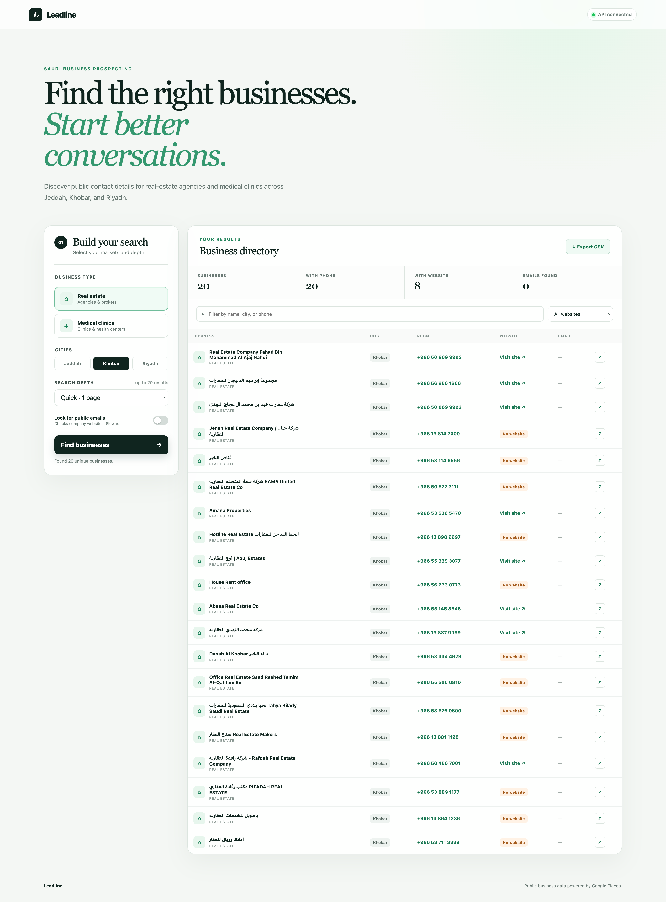
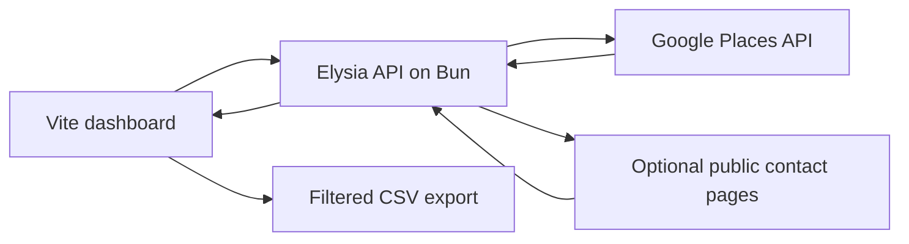

# Leadline

**A focused search-to-CSV workflow for Saudi business prospecting.**

[Preview](#preview) · [Quick start](#the-easy-way-macos) · [Architecture](#architecture) · [Terminal setup](#terminal-setup)

Find public phone numbers, websites, and emails for real-estate agencies and medical clinics across Jeddah, Khobar, and Riyadh—then export the results to CSV.

## Preview

Existing dashboard screenshot from this repository.



## Project story

**Problem.** Collecting public business contact details across several cities means repeating searches and manually organizing results.

**Approach.** A Vite interface sends a scoped search to an Elysia server, which queries Google Places and optionally checks public contact pages. The user filters the returned leads and exports the current view.

**Current result.** A local dashboard with city/category filters, contact details, and CSV export. It supports Jeddah, Khobar, and Riyadh; Google limits the results returned per query. No hosted demo is advertised.

## Architecture



## The easy way (macOS)

1. [Install Bun](https://bun.sh) if you do not already have it.
2. [Download Leadline as a ZIP](https://github.com/abdulrhmanG-alahmadi/leadline/archive/refs/heads/main.zip) and unzip it.
3. Double-click **Start Leadline.command**.
4. On the first run, paste your Google Places API key when asked.

Leadline installs what it needs, starts the app, and opens <http://localhost:5173> automatically. Your API key is stored only in the local `.env` file, which Git ignores.

> If macOS blocks the launcher, right-click it and choose **Open** once.

## Get a Google Places API key

1. Open [Google Maps Platform credentials](https://console.cloud.google.com/google/maps-apis/credentials).
2. Create or select a Google Cloud project with billing enabled.
3. Enable **Places API (New)**.
4. Create an API key and restrict it to **Places API (New)**.

Because Leadline calls Google through its local Elysia server, HTTP-referrer restrictions do not apply. Use no application restriction for local testing, or restrict by the server's public IP when deploying.

## What it does

- Searches real-estate agencies and medical clinics in Jeddah, Khobar, and Riyadh
- Returns business name, phone, website status, address, and Google Maps link
- Optionally checks public website contact pages for email addresses
- Filters results by name, city, phone, or website availability
- Exports the current filtered results to an Excel-friendly CSV
- Keeps the Google key on the Elysia server instead of browser code

Google Text Search returns up to 60 relevance-ranked results per query. It is not an exhaustive business directory, and Places API requests are billable.

## Terminal setup

```bash
git clone https://github.com/abdulrhmanG-alahmadi/leadline.git
cd leadline
cp .env.example .env
# Add your Google Places API key to .env
bun install
bun run dev
```

Open <http://localhost:5173>.

## Commands

```bash
bun run dev      # Vite UI + Elysia API
bun test         # tests
bun run build    # production build
bun run start    # production server on localhost:3001
```

## Stack

Vite 8 · Elysia 1.4 · Bun · Google Places API (New)

## Responsible use

Use public business data responsibly. Follow Google Maps Platform terms, website terms, and applicable privacy and marketing laws. Google restricts caching and storage of Places content; Place IDs are the principal caching exception.

## License

MIT
